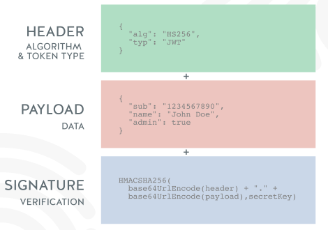
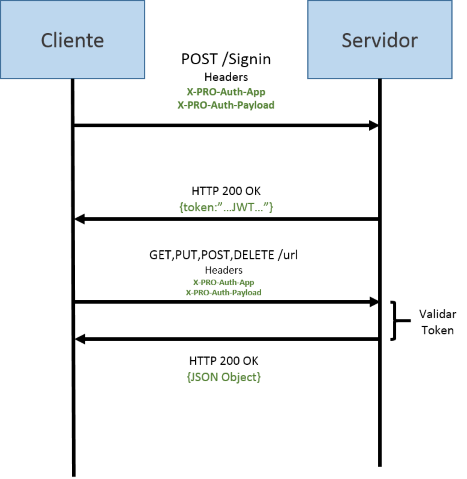

# Identificación de aplicaciones

Para identificar una aplicación, se utiliza el estándar de la industria conocido como [JSON Web Token](https://en.wikipedia.org/wiki/JSON_Web_Token). JWT es un objeto [JSON](https://en.wikipedia.org/wiki/JSON) que se define en el [RFC 7519](https://tools.ietf.org/html/rfc7519) como una forma segura de representar un conjunto de información entre dos partes. El token se compone de un encabezado (header), una carga (en adelante payload) y una firma (signature). En pocas palabras, un JWT es una cadena de texto con el siguiente formato:

```AsciiDoc

header.payload.signature

```

<center>

</center>

<center>
[Fuente imagen](https://nordicapis.com)
</center>

Para mostrar cómo y por qué se utiliza JWT, utilizaremos un ejemplo en donde participan dos entidades (ver el diagrama a continuación). Las entidades son el cliente (su aplicación) y el servidor de autenticación (nuestra API).

En este escenario su aplicación se identifica contra nuestra API a través de la información en un JWT que viaja en una cabecera HTTP personalizada, el servidor de autenticación crea el JWT de respuesta que contiene un token de autenticación y una fecha de vencimiento, para que su aplicación en adelante “presente” este JWT al servidor de autenticación en cada llamada a cualquier operación. El servidor de autenticación utilizará el JWT para verificar que la llamada al API provenga de una aplicación reconocida.

<center>

</center>
